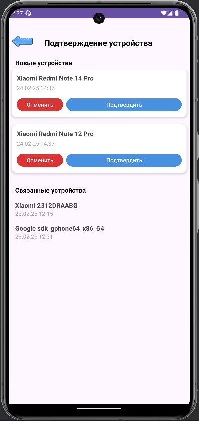
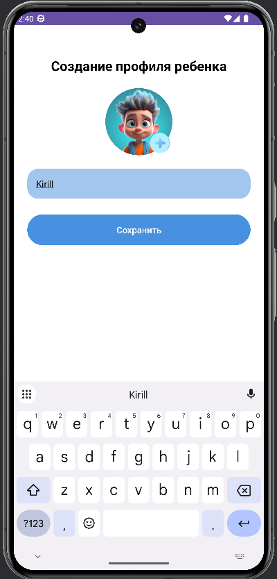
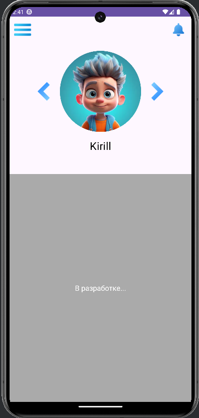
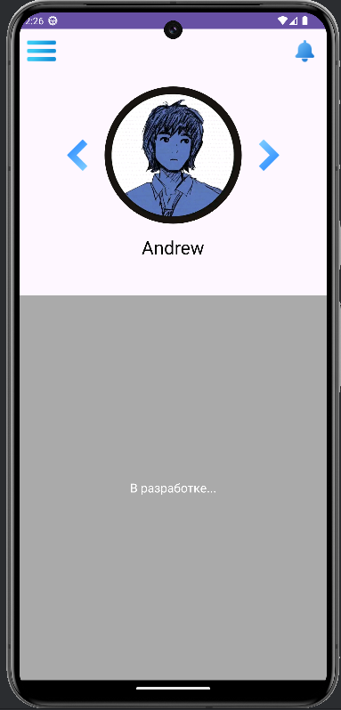

# practice-2025

## Тема: Власний додаток

### Frontend
[SafeWatchApp](https://github.com/winxzone/SafeWatchApp)

### Backend
[safewatchserver](https://github.com/winxzone/safewatchserver)

За час практики був додан функціонал мобільного додатку SafeWatchApp для платформи Android, спрямованого на батьківський контроль пристроїв дітей.

---

## Що було зроблено

### 1. Реєстрація пристрою дитини
Розроблено механізм, який дозволяє пристрою дитини надсилати запит на сервер для реєстрації. Унікальний ідентифікатор пристрою передається у запиті, після чого пристрій з’являється у списку непідтверджених у батьківському додатку.

**Скріншот 1: Список непідтверджених пристроїв**

*Опис: Екран у батьківському додатку, де відображаються запит на підтвердження пристрою дитини.*

### 2. Підтвердження пристрою та створення профілю
Батько може підтвердити пристрій через інтерфейс, ввівши ім’я дитини та додавши фото. Запит обробляє підтвердження, створює профіль у базі даних та прив’язує пристрій до нього.

**Скріншот 2: Екран додавання профілю**

*Опис: Форма для введення імені та вибору фото.*

### 3. Збереження фотографій у GridFS
Фотографії профілів завантажуються на сервер і зберігаются у GridFS у MongoDB. Ідентифікатор фото записується у профіль дитини для подальшого доступу.

**Скріншот 3: Профіль із фото**

*Опис: Відображення профілю дитини з фотографією після успішного додавання.*

### 4. Перегляд списку дітей
Батько може переглядати доданих дітей через запит, який повертає дані профілів із їхніми іменами та фотографіями.

**Скріншот 4: Список доданих дітей**

---

## Висновок

За час практики було реалізовано важливу частину функціоналу SafeWatchApp, яка включає реєстрацію пристроїв, їх підтвердження та створення профілів дітей із підтримкою завантаження фотографій. Цей етап став основою для майбутнього розвитку додатку. Використання сучасних технологій, таких як Ktor, Retrofit та MongoDB із GridFS, дозволило створити ефективну систему взаємодії між клієнтом і сервером. У майбутньому планується додати функції моніторингу активності та сповіщень для повноцінного використання додатку.

---
